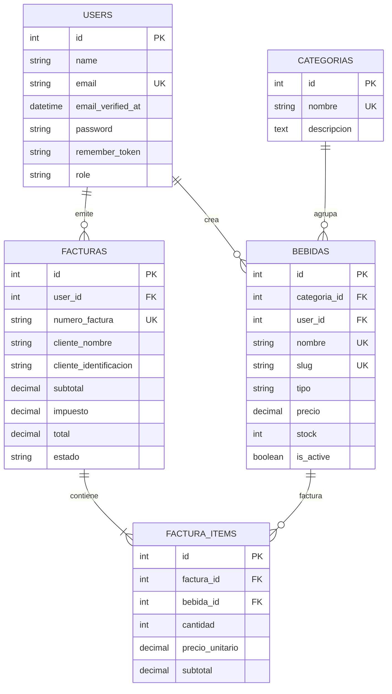

# Documentación técnica completa del Sistema de Bebidas

**Proyecto:** `sistema-bebidas`  
**Fecha del análisis:** 24 de septiembre de 2026  
**Tecnologías principales:** Laravel 13, PHP 8.3, Blade, Tailwind CSS, Alpine.js, Vite y SQLite  
**Tipo de aplicación:** aplicación web monolítica de gestión de bebidas, toma de pedidos y facturación

---

## 1. Propósito y alcance de este documento

Este documento explica la estructura, el funcionamiento, las decisiones de diseño, las buenas prácticas, las pruebas y los puntos que requieren atención del código propio del proyecto.

El análisis comprende:

- el arranque de Laravel;
- las rutas web y de autenticación;
- controladores, Form Requests, middleware y policies;
- modelos Eloquent, enums y relaciones;
- migraciones, fábrica y seeder;
- layouts, componentes, vistas Blade y assets;
- configuración de PHP, Composer, npm, base de datos, sesiones, caché, colas y correo;
- pruebas automatizadas y su cobertura;
- los flujos completos de administración, POS, carrito y facturación;
- las buenas prácticas realmente aplicadas;
- los riesgos y defectos que se observan actualmente.

No se documenta línea por línea el contenido de `vendor/`, `node_modules/`, archivos generados de Vite, vistas compiladas en `storage/framework/views/` ni el código interno de bibliotecas de terceros. Esas carpetas no forman parte del código mantenido por el proyecto. Sí se explican los archivos de configuración estándar que afectan su funcionamiento.

No se revelaron valores secretos de `.env`. Las variables se describen utilizando `.env.example` y el archivo local únicamente como configuración de ejecución, sin mostrar credenciales.

---

## 2. Resumen ejecutivo

El sistema es una aplicación web para administrar un catálogo de bebidas, permitir que personal operativo tome pedidos mediante un punto de venta sencillo y genere facturas.

Sus dos perfiles principales son:

- **Administrador:** gestiona el catálogo de bebidas y consulta todas las facturas.
- **Mesero:** consulta el menú, arma un carrito, cobra y consulta sus propias facturas.

La aplicación utiliza una arquitectura Laravel clásica:

```text
Navegador
   ↓ HTTP
Ruta web
   ↓ middleware
Controller / FormRequest
   ↓
Eloquent / sesión / policies
   ↓
Vista Blade + Tailwind + Alpine
   ↓
HTML/JSON y redirecciones
```

No existe una API REST ni una SPA. La interfaz se genera en el servidor y utiliza formularios HTML tradicionales. Alpine.js se usa solamente para la navegación móvil, el menú desplegable de usuario y el modal de eliminación de cuenta.

El proyecto tiene una base técnica sólida: validación de servidor, CSRF, escapado con Blade, autenticación, policies, protección de roles, transacciones, eager loading, paginación, modelos con casts, factories y pruebas automatizadas. No obstante, todavía conserva partes del esqueleto Laravel/Breeze y presenta inconsistencias funcionales importantes en el control de bebidas, disponibilidad, stock, errores del checkout, verificación de correo y presentación.

---

## 3. Funcionalidades disponibles

### 3.1 Administrador

Puede:

- iniciar sesión y cerrar sesión;
- administrar su perfil y contraseña;
- listar bebidas con paginación;
- crear bebidas;
- editar bebidas;
- eliminar bebidas;
- consultar todas las facturas;
- filtrar facturas por texto, identificación, estado y rango de fechas;
- revisar importes y cantidad de productos;
- abrir el detalle de una factura.

### 3.2 Mesero o usuario autenticado

Puede:

- registrarse mediante el formulario público;
- abrir el punto de venta;
- buscar bebidas por nombre;
- agregar bebidas al carrito;
- modificar cantidades;
- eliminar productos o vaciar el carrito;
- introducir los datos del cliente;
- confirmar la venta y generar una factura;
- consultar únicamente las facturas que él mismo emitió;
- administrar su perfil y contraseña.

Actualmente las rutas del carrito, POS y creación de factura usan solamente `auth`, no `role:mesero`. Por ello, un administrador autenticado también puede utilizarlas. Esto puede ser intencional, pero debe ser una decisión explícita del negocio.

### 3.3 Visitante

Puede:

- abrir la portada pública;
- registrarse;
- iniciar sesión;
- solicitar restablecimiento de contraseña.

La portada `welcome.blade.php` todavía es la página genérica de Laravel y no representa el producto de bebidas.

---

## 4. Stack tecnológico

### 4.1 Backend

| Tecnología | Versión/estado | Función |
|---|---:|---|
| PHP | 8.3.31 | lenguaje del backend |
| Laravel Framework | 13.32.0 | framework web |
| Composer | 2.9.7 | gestión de paquetes PHP |
| Eloquent ORM | incluida en Laravel | acceso a base de datos |
| Blade | incluido en Laravel | motor de vistas HTML |
| PHPUnit | 12.5.35 | pruebas automatizadas |
| Mockery | 1.6.15 | dobles de prueba |
| Faker | 1.24.1 | datos falsos |
| Laravel Pint | 1.32.1 | formateo de PHP |
| Laravel Breeze | 2.4.2 | base de autenticación y perfil |
| Laravel Boost | 2.10.0 | herramientas de asistencia para desarrollo |
| Laravel Pail | 1.2.7 | inspección de logs desde terminal |
| Laravel Pao | 1.1.5 | salida de pruebas orientada a agentes |
| Collision | 8.9.5 | errores de consola más legibles |

### 4.2 Frontend y build

| Tecnología | Versión instalada | Función |
|---|---:|---|
| Node.js | 24.16.0 | ejecución de herramientas frontend |
| npm | 11.13.0 | gestor de paquetes JavaScript |
| Vite | 8.3.0 | bundler y servidor de desarrollo |
| laravel-vite-plugin | 3.2.0 | integración Vite/Laravel |
| Alpine.js | 3.17.3 | interacción local en navegador |
| Tailwind CSS | 3.4.19 | estilos utilitarios |
| `@tailwindcss/vite` | 4.3.3 | plugin de Tailwind 4 no conectado a la configuración actual |
| `@tailwindcss/forms` | 0.5.11 | estilos base de formularios |
| PostCSS | 8.5.28 | transformación CSS |
| Autoprefixer | 10.6.1 | prefijos CSS |
| Concurrently | 10.0.5 | declarado, pero sin script propio que lo utilice |

### 4.3 Base de datos y servicios

La configuración activa utiliza:

- **motor:** SQLite;
- **archivo local:** `database/database.sqlite`;
- **sesiones:** base de datos;
- **caché:** base de datos;
- **colas:** base de datos;
- **correo:** log;
- **broadcast:** log.

También se mantienen definiciones preparadas para MySQL, MariaDB, PostgreSQL, SQL Server y Redis, pero no son el motor activo.

---

## 5. Arquitectura y separación de responsabilidades

### 5.1 Capa HTTP

Las rutas web se definen principalmente en `routes/web.php` y `routes/auth.php`. Los middleware resuelven acceso general y roles. Los Form Requests validan y, cuando corresponde, autorizan entradas.

### 5.2 Capa de aplicación

Los controladores coordinan:

- lectura de la petición;
- autorización;
- validación;
- consultas Eloquent;
- operaciones de sesión;
- transacciones;
- redirecciones y mensajes flash.

No existe una capa de servicios o acciones separada. La lógica de venta está concentrada en `FacturaController::store()`. Para el tamaño actual puede funcionar, pero si el dominio crece conviene extraer una acción `CreateInvoiceFromCart` o un servicio de checkout.

### 5.3 Capa de dominio y persistencia

Los modelos Eloquent representan:

- usuarios;
- categorías;
- bebidas;
- facturas;
- elementos de factura.

Los enums `TipoBebida` y `EstadoFactura` limitan los valores permitidos en el dominio.

### 5.4 Capa de presentación

Blade renderiza el HTML. Tailwind aporta estilos y Alpine controla estado efímero de interfaz. No hay llamadas AJAX a una API.

### 5.5 Capa de pruebas

`tests/Feature` prueba comportamiento HTTP. `tests/Unit` contiene únicamente el test de ejemplo generado por Laravel. `tests/TestCase.php` es la base común.

---

## 6. Estructura de directorios propia

```text
app/
├── Enums/                       Estados y tipos de dominio
├── Http/
│   ├── Controllers/             Controladores de negocio
│   │   └── Auth/                Controladores de autenticación Breeze
│   ├── Middleware/              Middleware de roles
│   └── Requests/                Validación de entrada
├── Models/                      Modelos Eloquent
├── Policies/                    Autorización por modelo
├── Providers/                   Registro y arranque de servicios
└── View/Components/             Clases de componentes de layout

bootstrap/
├── app.php                      Configuración de routing, middleware y excepciones
├── providers.php                Providers registrados
└── cache/                       Caché generada, no código fuente

config/                           Configuración Laravel
database/
├── factories/                   Generador de usuarios de prueba
├── migrations/                  Evolución del esquema
└── seeders/                     Datos iniciales

resources/
├── css/app.css                  Entrada CSS
├── js/app.js                    Entrada JavaScript
└── views/                       Blade, layouts, componentes y pantallas

routes/
├── web.php                      Rutas de negocio y perfil
├── auth.php                     Rutas de autenticación
└── console.php                  Comandos Artisan de archivo

tests/
├── Feature/                     Pruebas de comportamiento HTTP
└── Unit/                        Pruebas unitarias

public/
├── index.php                    Front controller web
├── .htaccess                    Reglas para Apache
├── robots.txt                   Permitencia de indexación
└── favicon.ico                  Favicon estándar

routes, config, resources, database, tests y bootstrap forman el núcleo mantenido del proyecto.
```

---

## 7. Arranque de la aplicación

### 7.1 `public/index.php`

Es el punto de entrada público. En orden:

1. define `LARAVEL_START` para medir el tiempo de inicio;
2. carga el archivo de mantenimiento si existe;
3. carga `vendor/autoload.php`;
4. instancia la aplicación desde `bootstrap/app.php`;
5. entrega la petición a `handleRequest()`.

Este archivo separa la carpeta pública del código de aplicación y evita exponer PHP, configuración o almacenamiento.

### 7.2 `artisan`

`artisan` es el punto de entrada de comandos de consola. Define el tiempo de inicio, carga Composer, crea la aplicación y llama a `handleCommand()`.

### 7.3 `bootstrap/app.php`

`Application::configure()` registra:

- `routes/web.php`;
- `routes/console.php`;
- health check en `/up`;
- alias `role` para `CheckRole`;
- una política JSON para rutas `api/*` o peticiones que esperan JSON.

No hay rutas API propias actualmente.

### 7.4 `bootstrap/providers.php`

Registra `AppServiceProvider`. Si en el futuro se incorporan otros proveedores de servicios globales, deben añadirse en este archivo.

### 7.5 `AppServiceProvider`

`register()` está vacío porque la aplicación no tiene bindings propios. `boot()` activa:

```php
Model::preventLazyLoading(! app()->isProduction());
```

Así, durante desarrollo y pruebas, Laravel lanza una excepción si una vista intenta acceder a una relación que no fue eager loaded. En producción la protección se desactiva para no introducir ese coste en cada relación.

---

## 8. Autenticación

La autenticación fue generada con Laravel Breeze y fue adaptada ligeramente.

### 8.1 `config/auth.php`

Define:

- guard por defecto `web`;
- autenticación basada en sesión;
- proveedor Eloquent `App\Models\User`;
- tabla `password_reset_tokens`;
- expiración de tokens de 60 minutos;
- espera de 60 segundos para emitir nuevos tokens;
- ventana de confirmación de contraseña de 10.800 segundos, tres horas.

### 8.2 Modelo `User`

`app/Models/User.php` extiende `Authenticatable` y usa:

- `HasFactory`;
- `Notifiable`.

Usa atributos de Laravel 13:

- `#[Fillable(['name', 'email', 'password'])]`;
- `#[Hidden(['password', 'remember_token'])]`.

Casts:

- `email_verified_at` como datetime;
- `password` como `hashed`.

El campo `role` no es fillable, por lo que un usuario no puede cambiar su propio rol mediante un endpoint de perfil o un request normal.

**Importante:** `User` no implementa `Illuminate\Contracts\Auth\MustVerifyEmail`. La clase base aporta los métodos, pero el middleware `verified` sólo exige el correo cuando el usuario implementa ese contrato. En este proyecto `/dashboard` tiene middleware `verified`, pero actualmente esa verificación no se impone. Además, el listener que envía la notificación de verificación también condiciona el envío al contrato, por lo que el flujo automático de Breeze queda incompleto.

### 8.3 Registro: `RegisteredUserController`

Valida:

- nombre requerido, string, máximo 255;
- email requerido, lowercase, válido, único;
- contraseña confirmada y con la política predeterminada de Laravel.

Luego crea el usuario, dispara `Registered`, inicia sesión y redirige al dashboard. Como `role` no es fillable y la migración establece `mesero` por defecto, los registros públicos se convierten en meseros.

**Riesgo de negocio:** si el registro debe ser exclusivamente para personal autorizado, la ruta pública `/register` debe deshabilitarse y reemplazarse por una invitación o alta administrativa.

### 8.4 Inicio de sesión: `LoginRequest` y `AuthenticatedSessionController`

`LoginRequest` valida email y contraseña. `authenticate()`:

1. verifica el rate limit;
2. llama a `Auth::attempt()`;
3. incrementa el limitador si falla;
4. limpia el limitador si tiene éxito;
5. genera el error de autenticación en caso contrario.

Se permiten cinco intentos. La clave combina email normalizado e IP:

```text
email|ip
```

Tras autenticarse, el controlador regenera la sesión para prevenir session fixation y redirige a la URL intended o al dashboard.

### 8.5 Logout

`destroy()`:

- cierra el guard `web`;
- invalida la sesión;
- regenera el token;
- redirige a `/`.

### 8.6 Recuperación de contraseña

- `PasswordResetLinkController` valida el email y solicita un token.
- `NewPasswordController` valida token, email, contraseña y confirmación.
- Actualiza la contraseña y token de recordatorio.
- Dispara el evento `PasswordReset`.

### 8.7 Cambio de contraseña

`PasswordController` exige la contraseña actual, valida la nueva y confirma que el hash almacenado cambia. Los errores se guardan en el bag `updatePassword`.

### 8.8 Confirmación de contraseña

`ConfirmablePasswordController` compara la contraseña con el guard. Si es correcta, guarda `auth.password_confirmed_at` y redirige a la URL intended.

### 8.9 Verificación de email

Existen rutas, controladores y vistas, pero el contrato `MustVerifyEmail` está comentado en `User`. Por ello:

- las pruebas pueden marcar manualmente el correo mediante una URL firmada;
- el middleware no bloquea a usuarios que no implementan el contrato;
- el evento automático de registro no garantiza el envío de correo;
- la condición de reenvío dentro del perfil tampoco se muestra, porque exige `instanceof MustVerifyEmail`.

---

## 9. Autorización y roles

### 9.1 Middleware `CheckRole`

`app/Http/Middleware/CheckRole.php` recibe un rol de ruta, por ejemplo `admin`. Si no hay usuario o `user.role` no coincide exactamente, responde con HTTP 403 y el mensaje `Acceso no autorizado para este perfil.`

Se registra como alias `role` en `bootstrap/app.php`.

### 9.2 Roles existentes

- `admin`: acceso administrativo.
- `mesero`: rol predeterminado.

El rol es un string libre, no un enum. No existe un `CHECK` en base de datos que limite sus valores ni una interfaz para administrarlo. Los roles no reconocidos no entran al módulo administrativo, pero sí pueden usar las rutas operativas que sólo exigen `auth`.

### 9.3 `BebidaPolicy`

La policy utiliza `before()` para conceder cualquier permiso a un administrador. Para otros usuarios:

- `viewAny`, `view`, `create`, `restore`, `forceDelete` retornan `false`;
- `update` y `delete` permiten únicamente al creador de la bebida.

El método `before()` hace que la regla de propietario sea irrelevante para administradores.

La aplicación llama explícitamente a `Gate::authorize()` en create, edit, update y delete. El listado y store están protegidos principalmente por `role:admin`; no hay una llamada de policy equivalente en esos métodos.

### 9.4 `FacturaPolicy`

- `viewAny`: sólo administradores.
- `view`: administradores o el mesero propietario de la factura.

`IndexFacturaRequest::authorize()` también consulta `viewAny`, de modo que el listado combina middleware de rol y policy.

La vista de detalle llama `Gate::authorize('view', $factura)`, evitando que un mesero vea facturas de otro usuario. La prueba correspondiente verifica un caso correcto y uno prohibido.

---

## 10. Mapa completo de rutas

### 10.1 Rutas de negocio

| Método | URI | Nombre | Acceso | Controlador/uso |
|---|---|---|---|---|
| GET | `/` | — | público | vista `welcome` |
| GET | `/dashboard` | `dashboard` | `auth`, `verified` | closure; vista `dashboard` |
| GET | `/profile` | `profile.edit` | `auth` | `ProfileController@edit` |
| PATCH | `/profile` | `profile.update` | `auth` | `ProfileController@update` |
| DELETE | `/profile` | `profile.destroy` | `auth` | `ProfileController@destroy` |
| GET | `/admin/bebidas` | `admin.bebidas.index` | `auth`, `role:admin` | listar bebidas |
| POST | `/admin/bebidas` | `admin.bebidas.store` | `auth`, `role:admin` | crear bebida |
| GET | `/admin/bebidas/create` | `admin.bebidas.create` | `auth`, `role:admin` | formulario de alta |
| GET | `/admin/bebidas/{bebida:slug}` | `admin.bebidas.show` | `auth`, `role:admin` | método vacío |
| GET | `/admin/bebidas/{bebida:slug}/edit` | `admin.bebidas.edit` | `auth`, `role:admin` | formulario de edición |
| PUT/PATCH | `/admin/bebidas/{bebida:slug}` | `admin.bebidas.update` | `auth`, `role:admin` | actualizar bebida |
| DELETE | `/admin/bebidas/{bebida:slug}` | `admin.bebidas.destroy` | `auth`, `role:admin` | eliminar bebida |
| GET | `/admin/facturas` | `admin.facturas.index` | `auth`, `role:admin` | filtrar y listar facturas |
| GET | `/pos` | `pos.index` | `auth` | `BebidaController@pos` |
| GET | `/carrito` | `carrito.index` | `auth` | ver carrito |
| POST | `/carrito/agregar/{bebida}` | `carrito.agregar` | `auth` | agregar por ID |
| PATCH | `/carrito/actualizar/{bebida}` | `carrito.actualizar` | `auth` | cambiar cantidad |
| DELETE | `/carrito/eliminar/{bebida}` | `carrito.eliminar` | `auth` | quitar producto |
| POST | `/carrito/vaciar` | `carrito.vaciar` | `auth` | borrar carrito |
| POST | `/facturas` | `facturas.store` | `auth` | cerrar venta |
| GET | `/facturas/{factura}` | `facturas.show` | `auth` + policy | ver factura propia o cualquier admin |

La ruta resource genera `show` automáticamente, pero `BebidaController::show()` no contiene una implementación.

### 10.2 Rutas de autenticación

| Método | URI | Nombre | Acceso |
|---|---|---|---|
| GET | `/register` | `register` | `guest` |
| POST | `/register` | — | `guest` |
| GET | `/login` | `login` | `guest` |
| POST | `/login` | — | `guest` |
| GET | `/forgot-password` | `password.request` | `guest` |
| POST | `/forgot-password` | `password.email` | `guest` |
| GET | `/reset-password/{token}` | `password.reset` | `guest` |
| POST | `/reset-password` | `password.store` | `guest` |
| GET | `/verify-email` | `verification.notice` | `auth` |
| GET | `/verify-email/{id}/{hash}` | `verification.verify` | `auth`, `signed`, `throttle:6,1` |
| POST | `/email/verification-notification` | `verification.send` | `auth`, `throttle:6,1` |
| GET | `/confirm-password` | `password.confirm` | `auth` |
| POST | `/confirm-password` | — | `auth` |
| PUT | `/password` | `password.update` | `auth` |
| POST | `/logout` | `logout` | `auth` |

### 10.3 Ruta operativa

`/up` es el health check registrado en `bootstrap/app.php` y permite comprobar que la aplicación arranca.

---

## 11. Enums de dominio

### 11.1 `TipoBebida`

`app/Enums/TipoBebida.php` es un enum de tipo string con cuatro casos:

- `REFRESCO = refresco`;
- `CERVEZA = cerveza`;
- `COCTEL = coctel`;
- `AGUA = agua`.

`label()` devuelve textos descriptivos para interfaz. Sin embargo, las vistas de creación y edición usan `$tipo->name`, y el listado usa `$bebida->tipo->value`, por lo que el método de presentación no se aprovecha.

### 11.2 `EstadoFactura`

Define:

- `PAGADA = pagada`;
- `ANULADA = anulada`;
- `PENDIENTE = pendiente`.

`etiqueta()` convierte el valor interno en `Pagada`, `Anulada` o `Pendiente`. Este método sí se utiliza en el listado y el detalle.

El enum contiene más estados que los que el flujo actual puede producir: `store()` sólo crea facturas pagadas. No hay acciones para anular, marcar pendiente o cobrar.

---

## 12. Modelos Eloquent

### 12.1 `User`

Responsabilidades:

- autenticación;
- perfil;
- contraseñas;
- notificaciones;
- rol como atributo de tipo string;
- relación indirecta con bebidas creadas y facturas emitidas.

Fillable mediante atributo:

```text
name, email, password
```

Hidden:

```text
password, remember_token
```

Casts:

- `email_verified_at => datetime`;
- `password => hashed`.

Observaciones:

- `role` no aparece entre los atributos permitidos, una buena protección contra mass assignment;
- no implementa `MustVerifyEmail`;
- no define relaciones con bebidas o facturas, aunque no son necesarias para el código actual.

### 12.2 `Bebida`

Campos fillable:

- `categoria_id`;
- `user_id`;
- `nombre`;
- `slug`;
- `tipo`;
- `precio`;
- `stock`;
- `is_active`.

Casts:

- `tipo => TipoBebida`;
- `precio => decimal:2`;
- `is_active => boolean`.

El mutador `nombre()` aplica `trim()` y `ucwords()` al asignar el nombre. Esto centraliza la normalización para asignaciones directas y actualizaciones Eloquent.

Relaciones:

- `categoria(): BelongsTo`;
- `user(): BelongsTo`.

Scopes:

- `disponibles()`: `is_active = true AND stock > 0`;
- `porTipo(TipoBebida)`: filtra por tipo.

**Uso real:** los scopes no se llaman en los controladores. `disponibles()` y `porTipo()` permanecen como API del modelo sin consumidores.

### 12.3 `Categoria`

Fillable:

- `nombre`;
- `descripcion`.

Relación `bebidas()` hacia `Bebida`. La relación es funcional, aunque no declara el tipo de retorno `HasMany` como sí ocurre en la mayoría de relaciones del proyecto.

### 12.4 `Factura`

Fillable:

- emisor;
- número;
- datos del cliente;
- subtotal, impuesto y total;
- estado.

Casts:

- estado a `EstadoFactura`;
- importes a `decimal:2`.

Relaciones:

- `user(): BelongsTo`;
- `items(): HasMany`.

### 12.5 `FacturaItem`

Representa una línea histórica de venta.

Fillable:

- factura;
- bebida;
- cantidad;
- precio unitario;
- subtotal.

Casts monetarios a decimal de dos posiciones.

Relaciones:

- `factura(): BelongsTo`;
- `bebida(): BelongsTo`.

El precio unitario y subtotal se copian en el momento de la venta. Esto evita que un cambio futuro de precio altere el comprobante histórico, siempre que la línea no sea eliminada.

---

## 13. Form Requests y validación

### 13.1 `StoreBebidaRequest`

Antes de validar:

- genera `slug` con `Str::slug(nombre)`;
- convierte `is_active` con `boolean()`.

Reglas:

| Campo | Reglas |
|---|---|
| nombre | requerido, string, máximo 100, único |
| slug | requerido, string, máximo 120, único |
| tipo | requerido, enum `TipoBebida` |
| precio | requerido, numérico, 0.01–9999.99 |
| stock | requerido, entero, mínimo 0 |
| categoria_id | requerido, existe en categorías |
| is_active | boolean |

`authorize()` devuelve `true` porque el acceso se restringe en la ruta mediante `role:admin`.

**Defecto funcional:** los formularios no envían `is_active`. `boolean()` convierte un valor ausente en `false`, por lo que el request puede guardar una bebida inactiva aunque la base de datos declare `true` como default.

### 13.2 `UpdateBebidaRequest`

Repite la normalización y reglas de creación. Las reglas `unique` ignoran el ID de la bebida que se está editando. También convierte un `is_active` ausente en `false`, lo que puede desactivar una bebida al guardar cualquier edición.

### 13.3 `IndexFacturaRequest`

Buena práctica: separa validación y autorización del controlador.

- `authorize()` exige `viewAny` sobre `Factura`.
- elimina espacios de `buscar` e `identificacion`;
- valida longitudes máximas;
- valida el estado contra el enum;
- valida fechas `Y-m-d`;
- exige que `hasta` sea igual o posterior a `desde` cuando ambas existen;
- `filtros()` elimina `null` y cadenas vacías.

Es un Form Request claro, reutilizable y con un contrato de entrada bien definido.

### 13.4 `ProfileUpdateRequest`

Valida nombre y email. El email:

- se exige lowercase;
- se valida como email;
- no puede superar 255 caracteres;
- debe ser único, ignorando el usuario actual.

### 13.5 `LoginRequest`

Además de validar, implementa autenticación, rate limit, eventos `Lockout` y mensajes de error. Es un buen ejemplo de separación de lógica de autenticación reutilizable.

### 13.6 Validaciones inline

Otros controladores utilizan `$request->validate()` porque las reglas son pequeñas:

- cantidad del carrito;
- datos del cliente;
- contraseña para eliminar la cuenta;
- password reset;
- cambio de contraseña.

Esta decisión es razonable y no requiere crear un Form Request para cada regla pequeña.

---

## 14. Controladores de negocio

### 14.1 `Controller`

Clase abstracta vacía. Permite que todos los controladores compartan una base común si en el futuro se incorporan traits o comportamiento transversal.

### 14.2 `BebidaController`

#### `index()`

- inicia una consulta Eloquent;
- eager loading de `categoria`;
- orden `latest()`;
- paginación de 15;
- devuelve `admin.bebidas.index`.

El comentario menciona un scope de disponibles, pero el código no lo utiliza. Para administración puede ser correcto mostrar también bebidas inactivas o agotadas.

#### `create()`

- autoriza `create`;
- carga todas las categorías;
- obtiene `TipoBebida::cases()`;
- devuelve el formulario.

#### `store()`

- recibe datos ya validados;
- agrega el ID del usuario autenticado;
- llama `Bebida::create()`;
- redirige al listado con mensaje flash.

Añadir `user_id` en servidor evita que el cliente elija el creador.

#### `show()`

Está vacío. La ruta existe, pero no devuelve vista ni respuesta. Debe implementarse o eliminarse mediante `->except('show')`.

#### `edit()`

- autoriza update;
- carga categorías y tipos;
- usa enlace implícito de modelo por ruta por slug;
- devuelve formulario.

#### `update()`

- autoriza;
- actualiza exclusivamente con `validated()`;
- redirige al listado.

#### `destroy()`

- autoriza delete;
- elimina la bebida;
- redirige con mensaje.

#### `pos()`

- recibe el parámetro opcional `buscar`;
- aplica `LIKE` mediante binding de Eloquent;
- ordena por nombre;
- pagina de 12 en 12;
- devuelve `mesero.pos`.

Observaciones:

- el comentario afirma que filtra activas o con stock, pero la consulta no aplica `disponibles()`;
- no llama `withQueryString()`, por lo que la búsqueda puede perderse al paginar;
- no hay validación de longitud para `buscar`;
- como en toda consulta Eloquent, el valor se vincula y no se concatena directamente a SQL.

### 14.3 `CarritoController`

El carrito reside en la sesión bajo la clave `carrito`. Su estructura es un array asociativo indexado por ID de bebida:

```php
[
    12 => [
        'id' => 12,
        'nombre' => 'Coca Cola',
        'precio' => '2.50',
        'cantidad' => 2,
        'subtotal' => '5.00',
    ],
]
```

#### `index()`

- obtiene el carrito;
- calcula subtotal con `array_reduce`;
- aplica IVA fijo de 16%;
- calcula total;
- pasa carrito y totales a la vista.

#### `agregar()`

- recupera la sesión;
- si la bebida ya existe, incrementa cantidad y recalcula subtotal;
- si no existe, crea una instantánea con ID, nombre, precio, cantidad 1 y subtotal;
- guarda el carrito;
- redirige atrás con mensaje.

No comprueba `is_active`, stock ni cantidad máxima.

#### `actualizar()`

- exige cantidad entera mínima 1;
- recalcula subtotal;
- guarda únicamente si la bebida está en el carrito.

No limita la cantidad al stock disponible.

#### `eliminar()`

Elimina la clave de la bebida y actualiza la sesión.

#### `vaciar()`

Ejecuta `session()->forget('carrito')`.

### 14.4 `FacturaController`

#### `index()`

Construye un filtro reutilizable:

- `buscar` busca en número, nombre o identificación;
- `identificacion` filtra específicamente el documento;
- `estado` usa el valor del enum;
- `desde` y `hasta` incluyen los días completos mediante `whereDate()`.

Antes de paginar:

- `with('user')` evita N+1 para el mesero;
- `withSum('items', 'cantidad')` calcula total de unidades sin cargar cada colección;
- `latest()` ordena por fecha;
- `withQueryString()` conserva filtros al cambiar de página.

Después usa clones de la consulta para:

- contar facturas;
- sumar importes;
- conservar la base para la vista.

Muestra todos los estados, pero el total registrado incluye también facturas anuladas o pendientes. Si el importe de negocio debe contar sólo ventas efectivas, el filtro debe limitarse a `PAGADA`.

#### `store()`

Es la operación central de venta:

1. valida nombre requerido e identificación opcional;
2. obtiene el carrito;
3. rechaza carrito vacío;
4. calcula subtotal, impuesto y total;
5. abre `DB::transaction()`;
6. crea una factura con número aleatorio `FAC-XXXXXXXX`;
7. por cada producto:
   - recupera la bebida con `findOrFail`;
   - comprueba stock;
   - crea `FacturaItem`;
   - decrementa stock;
8. confirma la transacción;
9. borra el carrito;
10. redirige al comprobante.

Si cualquier operación lanza una excepción, la transacción hace rollback. El carrito sólo se borra después del éxito.

Riesgos:

- la comprobación de stock y el decremento no usan un bloqueo de fila o actualización condicional atómica; dos clientes simultáneos pueden pasar la validación y producir sobreventa;
- el precio congelado proviene de la sesión y puede diferir del precio actual del catálogo;
- se usan operaciones de punto flotante para cálculos monetarios;
- el IVA está hardcodeado;
- el número aleatorio puede colisionar, aunque la restricción unique lo detecta;
- `catch (\Exception)` devuelve `$e->getMessage()` al usuario y no registra el fallo; una excepción de base de datos puede filtrar detalles técnicos;
- no existe idempotencia contra doble clic ni integración real de pago.

#### `show()`

- autoriza `view`;
- eager loading de `user` e `items.bebida`;
- devuelve `facturas.show`.

### 14.5 `ProfileController`

#### `edit()`

Pasa el usuario autenticado a la vista.

#### `update()`

- recibe `ProfileUpdateRequest`;
- hace fill sólo con nombre y email;
- si cambia el email, vacía `email_verified_at`;
- guarda;
- redirige con estado `profile-updated`.

#### `destroy()`

- exige contraseña actual en el bag `userDeletion`;
- cierra sesión;
- elimina usuario;
- invalida sesión;
- regenera token;
- redirige a `/`.

Las claves foráneas en cascada hacen que eliminar el usuario pueda eliminar también bebidas, facturas e elementos vinculados.

---

## 15. Controladores de autenticación

### 15.1 Registro

`RegisteredUserController::store()` valida, hashea, crea usuario, dispara `Registered`, inicia sesión y redirige.

### 15.2 Login/logout

`AuthenticatedSessionController` delega autenticación a `LoginRequest`, regenera sesión, y en logout invalida todos los datos de sesión.

### 15.3 Email

- `EmailVerificationPromptController` muestra la vista o redirige si el correo ya está verificado.
- `EmailVerificationNotificationController` reenvía notificación.
- `VerifyEmailController` procesa una URL firmada, marca el correo y dispara `Verified`.

El esqueleto está presente, pero la falta del contrato `MustVerifyEmail` en `User` reduce su eficacia real.

### 15.4 Contraseñas

- `PasswordResetLinkController`: solicita enlace.
- `NewPasswordController`: valida y reemplaza contraseña.
- `ConfirmablePasswordController`: confirma identidad.
- `PasswordController`: cambia contraseña autenticado.

---

## 16. Componentes PHP de layout

### 16.1 `AppLayout`

Componente de clase que renderiza `layouts.app`. Permite usar `<x-app-layout>` y `<x-slot name="header">`.

### 16.2 `GuestLayout`

Renderiza `layouts.guest`, usado por login, registro, recuperación, reset, confirmación y verificación.

Ambos componentes delegan la presentación a Blade y mantienen los controladores libres de HTML.

---

## 17. Base de datos

### 17.1 Diagrama de relaciones



### 17.2 Tabla `users`

Columnas relevantes:

- `id`: PK autoincremental;
- `name`: requerido;
- `email`: requerido y único;
- `email_verified_at`: nullable;
- `password`: requerido;
- `remember_token`: nullable;
- timestamps;
- `role`: requerido, con valor predeterminado `mesero`.

Índice único: `users_email_unique`.

### 17.3 Tabla `categorias`

- `id`: PK;
- `nombre`: requerido y único;
- `descripcion`: text nullable;
- timestamps.

### 17.4 Tabla `bebidas`

- `id`: PK;
- `categoria_id`: FK a categorías, cascade;
- `user_id`: FK a usuarios, cascade;
- `nombre`: único;
- `slug`: único;
- `tipo`: string controlado por enum;
- `precio`: decimal(8,2), unsigned;
- `stock`: unsigned integer, default 0;
- `is_active`: boolean, default true;
- timestamps.

Índices únicos: nombre y slug.

### 17.5 Tabla `facturas`

- `id`: PK;
- `user_id`: FK a usuarios, cascade;
- `numero_factura`: único;
- cliente requerido;
- identificación opcional;
- subtotal, impuesto y total decimal(10,2), unsigned;
- estado con valor predeterminado `pagada`;
- timestamps.

### 17.6 Tabla `factura_items`

- `id`: PK;
- factura_id FK cascade;
- bebida_id FK cascade;
- cantidad unsigned;
- precio unitario decimal(8,2) frozen;
- subtotal decimal(10,2);
- timestamps.

No hay índices compuestos explícitos para consulta por usuario, estado o fecha. El volumen actual puede ser pequeño, pero un historial grande se beneficiaría de índices medidos sobre `facturas.created_at`, `facturas.user_id` y posiblemente `facturas.estado`.

### 17.7 Tablas de infraestructura

Laravel también crea:

- `password_reset_tokens`;
- `sessions`;
- `cache`;
- `cache_locks`;
- `jobs`;
- `job_batches`;
- `failed_jobs`;
- `migrations`.

Aunque la cola y la caché no tienen jobs de negocio propios, forman parte del esqueleto listo para usar.

---

## 18. Migraciones

### 18.1 Migración inicial de usuarios

`0001_01_01_000000_create_users_table.php` crea usuarios, tokens de reset y sesiones. `down()` elimina las tres tablas.

### 18.2 Migración de caché

`0001_01_01_000001_create_cache_table.php` crea `cache` y `cache_locks`, con clave primaria, contenido, expiración e índices.

### 18.3 Migración de colas

`0001_01_01_000002_create_jobs_table.php` crea:

- `jobs`;
- `job_batches`;
- `failed_jobs`.

Incluye índices para cola y para `connection, queue, failed_at`.

### 18.4 Rol de usuario

`2026_09_17_141634_add_role_to_users_table.php` agrega `role` después de email, con valor predeterminado `mesero`.

**Defecto:** `down()` está vacío. Un rollback no elimina la columna y deja el esquema inconsistente.

La migración también importa modelos para crear las claves foráneas. En migraciones históricas es más robusto escribir las tablas de forma explícita o usar strings, porque un cambio futuro en el modelo no debe alterar una migración ya desplegada.

### 18.5 Categorías

Crea la tabla y el índice único del nombre. `down()` elimina la tabla.

### 18.6 Bebidas

Crea las claves foráneas y restricciones, unicidad de nombre/slug, precio decimal, stock, estado activo y timestamps. `down()` elimina la tabla.

### 18.7 Facturas

Crea cabecera de factura, importes decimales, estado y número único. `down()` elimina la tabla.

### 18.8 Items de factura

Crea detalle de venta, claves foráneas en cascada, cantidad y instantáneas de precios. `down()` elimina la tabla.

**Impacto de cascadas:** eliminar una bebida elimina las líneas de factura que la referencian. Para un sistema que necesita trazabilidad, normalmente es mejor `nullOnDelete` junto con un snapshot de nombre, o `restrictOnDelete` para impedir borrar productos usados. La implementación actual puede perder histórico de ventas al borrar una bebida.

---

## 19. Factory y seeder

### 19.1 `UserFactory`

Genera:

- nombre falso;
- email único;
- correo marcado como verificado;
- contraseña hasheada;
- token de recordatorio.

La contraseña hasheada se memoriza en una propiedad estática para no recalcularla en cada usuario del test.

El estado `unverified()` establece `email_verified_at = null`.

El factory no asigna rol explícitamente, por lo que utiliza el valor predeterminado de base de datos `mesero`.

### 19.2 `DatabaseSeeder`

Usa `WithoutModelEvents` y crea:

- administrador de prueba;
- mesero de prueba;
- cinco categorías: Refrescos, Cervezas, Licores, Juegos y Aguas, Cocteles.

Las credenciales de prueba están fijas en el seeder. Son útiles para desarrollo, pero este seeder **no debe ejecutarse en producción** sin un mecanismo seguro de credenciales iniciales.

No crea bebidas ni facturas de ejemplo.

---

## 20. Frontend y build

### 20.1 `resources/css/app.css`

Contiene las tres directivas de Tailwind 3:

```css
@tailwind base;
@tailwind components;
@tailwind utilities;
```

No existe CSS propio adicional.

### 20.2 `resources/js/app.js`

Importa Alpine, lo expone en `window.Alpine` y ejecuta `Alpine.start()`.

No existe JavaScript de negocio, AJAX, fetch, Axios ni estado global.

### 20.3 `vite.config.js`

Declara como entradas:

- `resources/css/app.css`;
- `resources/js/app.js`.

Usa `laravel-vite-plugin` y `refresh: true`.

### 20.4 `tailwind.config.js`

Escanea:

- vistas de paginación de Laravel;
- vistas compiladas;
- todos los Blade bajo `resources/views`.

Extiende la fuente sans con Figtree y registra `@tailwindcss/forms`.

### 20.5 `postcss.config.js`

Ejecuta Tailwind y Autoprefixer, flujo compatible con Tailwind 3.

### 20.6 Inconsistencia Tailwind 3/4

El proyecto instala Tailwind 3 como dependencia principal y también `@tailwindcss/vite` 4, pero no lo usa en `vite.config.js`. Además, `welcome.blade.php` contiene CSS inline y clases propias de Tailwind 4. La compilación pasa, pero la estrategia de estilos es ambigua y algunas clases nuevas podrían no generarse como se espera.

Debe elegirse una estrategia:

- Tailwind 3 + PostCSS y eliminar `@tailwindcss/vite`; o
- Tailwind 4 + `@tailwindcss/vite` y adaptar entradas/configuración.

### 20.7 Resultado verificado del build

`npm run build` finalizó correctamente:

- 4 módulos transformados;
- CSS aproximado de 51.76 kB, 9.35 kB gzip;
- JavaScript aproximado de 54.33 kB, 19.13 kB gzip.

Los archivos resultantes están en `public/build` y se encuentran ignorados por Git.

---

## 21. Layouts

### 21.1 `layouts/app.blade.php`

Layout de páginas autenticadas:

- HTML y viewport;
- meta token CSRF;
- título desde `config('app.name')`;
- Figtree;
- bundle Vite;
- navegación;
- header opcional;
- slot principal.

### 21.2 `layouts/guest.blade.php`

Layout centrado para invitados:

- logo;
- tarjeta de formulario;
- mismos assets globales;
- sin navegación autenticada.

### 21.3 `layouts/navigation.blade.php`

Usa Alpine para menú adaptable. Muestra:

- dashboard;
- gestión de bebidas si `viewAny` lo permite;
- facturas si `viewAny` lo permite;
- carrito;
- tomar pedidos;
- perfil y logout.

El contador global usa `count(session('carrito'))`, que equivale al número de productos distintos. El POS muestra unidades mediante `array_sum(cantidad)`. Son métricas diferentes.

Aspectos positivos:

- el backend no confía únicamente en ocultar enlaces;
- los formularios de logout llevan CSRF;
- los enlaces usan rutas nombradas.

Mejoras de accesibilidad:

- botón hamburguesa sin `aria-label`, `aria-expanded` y `aria-controls`;
- trigger del dropdown envuelto en `div` en lugar de `button`;
- falta `aria-current="page"` en enlaces activos;
- los SVG decorativos no están marcados.

---

## 22. Componentes Blade

| Componente | Función |
|---|---|
| `application-logo` | SVG inline del logo Laravel, acepta atributos |
| `auth-session-status` | muestra estado de autenticación en verde |
| `primary-button` | botón submit principal |
| `secondary-button` | botón no submit/cancelación |
| `danger-button` | acción destructiva |
| `text-input` | input con estilo y soporte disabled |
| `input-label` | label reutilizable |
| `input-error` | lista de errores de un campo |
| `nav-link` | enlace de escritorio con estado activo |
| `responsive-nav-link` | enlace móvil con estado activo |
| `dropdown-link` | enlace dentro del dropdown |
| `dropdown` | dropdown Alpine, animación y clic exterior |
| `modal` | modal Alpine, Escape, foco y bloqueo de scroll |

Los componentes usan `$attributes->merge()`, una buena práctica de Laravel para conservar atributos del consumidor y combinar clases.

El modal ofrece focus trap básico, pero debería añadir `role="dialog"`, `aria-modal="true"` y asociación explícita con título y descripción.

---

## 23. Vistas de autenticación

Todas utilizan `x-guest-layout`, formularios con CSRF, componentes de entrada y mensajes por campo.

- `auth/login.blade.php`: email, contraseña, remember me y recuperación.
- `auth/register.blade.php`: nombre, email, contraseña y confirmación.
- `auth/forgot-password.blade.php`: solicita email de reset.
- `auth/reset-password.blade.php`: token oculto, email y nueva contraseña.
- `auth/confirm-password.blade.php`: confirma contraseña actual.
- `auth/verify-email.blade.php`: explica y permite reenviar verificación o cerrar sesión.

Estas vistas permanecen en inglés mientras el negocio está en español. No existen archivos de traducción propios y `APP_LOCALE` es `en`.

---

## 24. Vistas de perfil

### 24.1 `profile/edit.blade.php`

Compone tres parciales:

1. información del perfil;
2. cambio de contraseña;
3. eliminación de cuenta.

### 24.2 Información de perfil

- PATCH;
- conserva valores con `old()`;
- muestra errores;
- contempla reenvío de email con un formulario separado;
- muestra estado temporal mediante Alpine.

Como `User` no implementa `MustVerifyEmail`, el bloque de reenvío no aparece actualmente.

### 24.3 Cambio de contraseña

- PUT mediante suplantación de método;
- contraseña actual obligatoria;
- nueva contraseña confirmada;
- errores en el bag `updatePassword`;
- confirmación temporal con Alpine.

### 24.4 Eliminación

- acción destructiva;
- modal accesible mediante teclado;
- confirmación de contraseña;
- bag `userDeletion`.

Es una de las áreas mejor implementadas del frontend.

---

## 25. Vistas de negocio

### 25.1 `dashboard.blade.php`

Es un placeholder que sólo muestra `You're logged in!`. No diferencia roles ni presenta métricas, stock, ventas o accesos rápidos.

### 25.2 `admin/bebidas/index.blade.php`

- botón de nueva bebida;
- mensaje de éxito;
- tabla paginada;
- categoría, tipo, precio y stock;
- editar y eliminar.

Buenas prácticas:

- eager loading de categoría;
- CSRF y suplantación de método;
- confirmación de eliminación;
- `@forelse`;
- paginación.

La tabla no muestra `is_active`, no posee `scope="col"` y no tiene wrapper explícito `overflow-x-auto`.

### 25.3 `admin/bebidas/create.blade.php`

- POST;
- nombre, categoría, tipo, precio y stock;
- errores;
- valores previos;
- enums y categorías dinámicos.

No contiene checkbox `is_active`, que es la causa del defecto de estado analizado.

### 25.4 `admin/bebidas/edit.blade.php`

Es el formulario equivalente con PUT spoofing y valores actuales. Tampoco permite editar `is_active`.

Las rutas administrativas usan binding por slug y los formularios usan `route()`, por lo que la URL se genera correctamente incluso si el binding cambia de ID a slug.

### 25.5 `mesero/pos.blade.php`

- buscador;
- grilla adaptable;
- tarjetas;
- precio y stock;
- agregar al carrito;
- estado vacío;
- paginación;
- contador de unidades.

Problemas:

- no utiliza `scopeDisponibles()`;
- siempre habilita agregar, incluso con stock 0;
- muestra `descripcion`, columna que no existe en `bebidas`;
- pierde el parámetro de búsqueda al paginar;
- el botón no indica cantidad máxima;
- en móvil el formulario de búsqueda necesita una disposición vertical.

### 25.6 Vista huérfana `mesero/index.blade.php`

Es una copia casi idéntica del listado administrativo, enlaza a rutas admin y no es devuelta por ningún controlador. No forma parte de un flujo activo y debe eliminarse o sustituirse por una vista real de mesero.

### 25.7 `carrito/index.blade.php`

- tabla de productos;
- actualización de cantidad;
- eliminación;
- subtotal, IVA y total;
- vaciar carrito;
- datos del cliente;
- confirmar factura.

Problema importante: sólo renderiza `session('success')`. El backend devuelve errores de checkout con `session('error')`, y los errores de validación del cliente no se muestran. El usuario puede volver al carrito sin explicación cuando falla la venta.

Tampoco restaura los datos del cliente con `old()`.

### 25.8 `admin/facturas/index.blade.php`

Es la vista administrativa más completa:

- tarjetas de resumen;
- búsqueda;
- identificación;
- estado;
- fechas;
- limpiar filtros;
- tabla con `scope="col"`;
- estado visual;
- cantidad total de productos;
- total;
- detalle;
- estado vacío;
- paginación que conserva filtros.

Usa `role="status"` y `role="alert"` en mensajes. Incluye `overflow-x-auto`, una buena práctica adaptable.

### 25.9 `facturas/show.blade.php`

Muestra comprobante:

- número, estado y fecha;
- cliente;
- mesero;
- items;
- importes;
- botón PDF.

El botón `Descargar PDF Factura` apunta a `#`; no hay ruta, servicio o generación PDF. Es una función visible pero no implementada.

La tabla no tiene desplazamiento móvil explícito.

### 25.10 `welcome.blade.php`

Es la landing oficial de Laravel 13, en inglés, con enlaces a documentación, Laracasts y Laravel Cloud. Incluye CSS inline de respaldo para una versión de Tailwind 4 y logo de Laravel. No representa el sistema de bebidas y no debe considerarse una portada final.

---

## 26. Rutas de consola

`routes/console.php` registra el comando `inspire`, que imprime una cita de Laravel. Es esqueleto estándar y no participa en el negocio.

### 26.1 Archivos públicos

- `public/index.php` es el front controller HTTP descrito en la sección 7.1.
- `public/.htaccess` desactiva MultiViews e índices, conserva las cabeceras `Authorization` y `X-XSRF-Token`, redirige barras finales y envía las rutas no físicas a `index.php`. Es la configuración de Apache; Nginx o IIS necesitarían reglas equivalentes en su configuración.
- `public/robots.txt` contiene `User-agent: *` y `Disallow:` vacío, por lo que permite indexación. Si el sistema es interno, debería restringirse.
- `public/favicon.ico` es el favicon estándar incluido por el esqueleto.
- `public/build` contiene los bundles generados por Vite y está excluido del control de versiones.

### 26.2 Convenciones y archivos de mantenimiento

- `.editorconfig` fija UTF-8, LF, cuatro espacios, newline final y eliminación de espacios sobrantes; Markdown conserva ese último ajuste.
- `.gitattributes` normaliza finales de línea y configura diffs para PHP, Blade, CSS, HTML y Markdown.
- `.gitignore` excluye `.env`, `vendor`, `node_modules`, builds, logs, claves y cachés.
- `database/.gitignore` excluye `*.sqlite*`, por lo que la base local no debería versionarse.
- `bootstrap/cache/.gitignore` excluye todos los archivos generados salvo el propio `.gitignore`.
- `.npmrc` desactiva scripts de instalación y habilita auditorías npm.
- `README.md` continúa siendo la documentación genérica de Laravel; este documento reemplaza esa necesidad con una referencia del dominio, pero no se modificó el README.
- La copia analizada no contiene metadatos de un repositorio Git; las reglas anteriores están preparadas para cuando se inicialice o se restaure el repositorio.

---

## 27. Configuración de Composer

### 27.1 Dependencias de producción

- `php ^8.3`;
- `laravel/framework ^13.17`;
- `laravel/tinker ^3.0`.

### 27.2 Dependencias de desarrollo

- Faker;
- Laravel Boost;
- Breeze;
- Pail;
- Pao;
- Pint;
- Mockery;
- Collision;
- PHPUnit.

### 27.3 Autoload PSR-4

```text
App\               => app/
Database\Factories\ => database/factories/
Database\Seeders\   => database/seeders/
Tests\              => tests/
```

### 27.4 Scripts

- `composer run setup`: instala dependencias, crea `.env` si falta, genera key, migra, instala npm y compila.
- `composer run dev`: ejecuta `php artisan dev`.
- `composer run test`: limpia configuración y ejecuta pruebas.
- scripts post Composer: descubre paquetes y publica assets.

Configuración adicional:

- autoload optimizado;
- instalaciones `dist`;
- paquetes ordenados;
- estabilidad estable preferida.

---

## 28. Configuración npm

`package.json` declara el proyecto como privado y ES module. Scripts:

- `npm run build`: `vite build`;
- `npm run dev`: `vite`.

Todas las dependencias principales están en `devDependencies`, porque el navegador no necesita instalar paquetes: Vite genera los bundles.

`@laravel/multiplex` es opcional y aparece como no instalada en `npm list`; no afecta el build actual.

---

## 29. Variables de entorno

`.env.example` documenta las variables necesarias. Las más relevantes para la aplicación son:

| Grupo | Variables |
|---|---|
| Aplicación | `APP_NAME`, `APP_ENV`, `APP_KEY`, `APP_DEBUG`, `APP_URL` |
| Locale | `APP_LOCALE`, `APP_FALLBACK_LOCALE`, `APP_FAKER_LOCALE` |
| Contraseñas | `BCRYPT_ROUNDS` |
| Base de datos | `DB_CONNECTION`, `DB_DATABASE`, etc. |
| Sesión | `SESSION_DRIVER`, `SESSION_LIFETIME`, `SESSION_ENCRYPT`, `SESSION_SECURE_COOKIE` |
| Cola | `QUEUE_CONNECTION` |
| Caché | `CACHE_STORE` |
| Mail | `MAIL_MAILER`, host, puerto, credenciales y remitente |
| AWS/S3 | credenciales y bucket |
| Vite | `VITE_APP_NAME` |

Buenas prácticas:

- `.env` está ignorado;
- `.env.production` está ignorado;
- las claves se leen en configuración y no se mostraron en el documento;
- `.env.example` no contiene claves reales.

Para producción deben establecerse como mínimo `APP_ENV=production`, `APP_DEBUG=false`, una `APP_KEY` segura, URL correcta, cookie de sesión segura bajo HTTPS y credenciales de correo reales.

---

## 30. Archivos de configuración

### 30.1 `config/app.php`

Configura nombre, entorno, depuración, URL, zona horaria UTC, idioma, idioma de respaldo, Faker, cifrado AES-256-CBC, clave de aplicación, claves anteriores y controlador de mantenimiento.

### 30.2 `config/auth.php`

Configura guard, proveedor, broker deContraseñas, expiración, límite de solicitudes y tiempo de confirmación.

### 30.3 `config/database.php`

Define SQLite, MySQL, MariaDB, PostgreSQL y SQL Server. SQLite usa por defecto `database/database.sqlite`, activa restricciones de claves foráneas y usa transacciones diferidas. También define Redis para caché y cola.

### 30.4 `config/cache.php`

Define array, database, file, storage, Memcached, Redis, DynamoDB, Octane y failover. El prefijo se deriva de `APP_NAME`. `serializable_classes=false` reduce el riesgo de gadget chains al deserializar la caché.

### 30.5 `config/session.php`

Define sesión en base de datos, 120 minutos y serialización JSON, cookies `HttpOnly` y `SameSite=Lax`. `secure` depende del entorno. `SESSION_ENCRYPT=false` por defecto.

### 30.6 `config/queue.php`

Define cola en base de datos y sincronía, Redis, SQS, deferred, background y failover. Los jobs fallidos se guardan en base de datos.

### 30.7 `config/logging.php`

Define stack, single, daily, monthly, Slack, Papertrail, stderr, syslog, errorlog, null y emergency. El canal activo es `stack/single` en desarrollo.

### 30.8 `config/mail.php`

Define SMTP, SES, Postmark, Resend, Sendmail, log, array, failover y round robin. El remitente global se configura por entorno.

### 30.9 `config/filesystems.php`

Define discos local privado, public y S3. `storage:link` expondría `storage/app/public` en `public/storage`. La revisión de `php artisan about` indicó que el enlace público no está creado actualmente. No es necesario mientras la aplicación no gestione archivos.

### 30.10 `config/services.php`

Expone credenciales para Postmark, Resend, SES y Slack. Ninguna integración de negocio está activa.

---

## 31. Pruebas automatizadas

### 31.1 Configuración

`phpunit.xml` define suites Unit y Feature y un entorno aislado:

- SQLite `:memory:`;
- `RefreshDatabase` donde aplica;
- Bcrypt con 4 rondas;
- caché, sesión y correo en memoria;
- cola síncrona;
- herramientas de debugging desactivadas.

Esta configuración reduce acoplamiento y acelera las pruebas.

### 31.2 Resultado verificado

```text
30 pruebas pasadas
76 aserciones
Duración aproximada: 3.14 segundos
```

También se verificó:

- sintaxis PHP válida en todos los archivos propios;
- build Vite correcto;
- `composer audit`: sin vulnerabilidades conocidas;
- `npm audit`: 0 vulnerabilidades.

### 31.3 Pruebas unitarias

`ExampleTest` sólo comprueba `true === true`. No aporta cobertura del dominio y puede considerarse una prueba de ejemplo.

### 31.4 Pruebas de funcionalidad

#### `Feature/ExampleTest`

Comprueba que `/` responde 200.

#### `FacturaIndexTest`

Verifica:

- visitante redirigido a login;
- mesero recibe 403 en listado;
- administrador ve facturas;
- filtros encuentran la factura correcta y excluyen otra;
- mesero ve su factura pero no la de otro;
- creación de datos auxiliar con importes válidos.

Es la mejor cobertura de autorización y consulta del proyecto.

#### `ProfileTest`

Verifica:

- renderizado del perfil;
- actualización de nombre/email;
- invalidación de verificación si cambia email;
- conservación si no cambia;
- eliminación con contraseña correcta;
- rechazo de contraseña incorrecta.

#### `AuthenticationTest`

Verifica la pantalla de inicio de sesión, la autenticación, el rechazo de una contraseña incorrecta y el cierre de sesión.

#### `EmailVerificationTest`

Verifica vista, URL válida y hash incorrecto. Estas pruebas prueban el esqueleto, aunque el modelo no implementa el contrato de verificación.

#### `PasswordConfirmationTest`

Verifica render, confirmación correcta e incorrecta.

#### `PasswordResetTest`

Verifica solicitud, recepción de notificación, renderizado de restablecimiento y actualización con token.

#### `PasswordUpdateTest`

Verifica cambio correcto y contraseña actual incorrecta.

#### `RegistrationTest`

Verifica renderizado y creación de usuario autenticado.

### 31.5 Cobertura ausente

No hay pruebas específicas para:

- CRUD de bebidas;
- política de bebidas;
- manejo de `is_active`;
- scope `disponibles`;
- búsqueda POS;
- paginación POS con query string;
- agregar, actualizar, eliminar y vaciar carrito;
- límites de stock;
- concurrencia de stock;
- creación de factura y elementos;
- rollback por excepción;
- limpieza del carrito;
- error visible en checkout;
- roles admin/mesero sobre todas las rutas;
- factura anulada o pendiente;
- descarga PDF.

Estas áreas son las candidatas prioritarias para ampliar cobertura.

---

## 32. Buenas prácticas aplicadas

### 32.1 Seguridad

- CSRF en formularios mutables.
- Regeneración de sesión al login.
- Invalidación y regeneración de token al logout.
- Límite manual de intentos de inicio de sesión por email + IP.
- Almacenamiento deContraseñas mediante hash y cast.
- Protección contra asignación masiva con `fillable`.
- Ocultamiento de contraseña y token de recordatorio.
- Rutas administrativas con `auth` y `role:admin`.
- Policies para bebidas y facturas.
- Eloquent bindings, evitando SQL interpolado.
- Blade `{{ }}` para escapar salida.
- Validación de enums, números, fechas, existencias y longitudes.
- Restricciones únicas y claves foráneas.
- Dependencias auditadas sin vulnerabilidades conocidas.
- `.env` ignorado por control de versiones.

### 32.2 Base de datos

- Migraciones versionadas.
- Relaciones Eloquent.
- Casts de boolean, enum, decimal y datetime.
- Claves foráneas y acciones de borrado explícitas.
- Precios históricos copiados a los elementos.
- Transacción para crear factura, elementos y descontar stock.
- Paginación para listados grandes.
- Resumen sin cargar colecciones completas mediante `withSum()`.

### 32.3 Mantenimiento

- Nombres de clases, métodos y archivos siguiendo convenciones Laravel.
- Form Requests para operaciones con reglas sustanciales.
- Enums para valores repetidos.
- Componentes Blade reutilizables.
- Rutas nombradas.
- Comentarios explicativos en decisiones no obvias.
- `Model::preventLazyLoading()` fuera de producción.
- Separación de layouts guest/app.
- Configuración por entorno.
- PHPUnit, Pint, Collision y herramientas de desarrollo.
- `.editorconfig` uniforme UTF-8/LF/espacios.
- Lockfiles Composer y npm.
- `.npmrc` con `ignore-scripts=true` y `audit=true`.

### 32.4 Frontend y UX

- Tailwind para diseño consistente.
- Componentes reutilizables.
- Mensajes flash.
- Estados vacíos.
- Paginación.
- Grillas adaptables.
- Tabla administrativa con desplazamiento horizontal.
- Modal con bloqueo de foco, Escape y bloqueo de scroll.
- `old()` para conservar formularios.
- Etiquetas asociadas y `autocomplete` en autenticación.
- Confirmación al eliminar bebidas.

---

## 33. Riesgos y problemas detectados

### 33.1 Prioridad alta

#### 1. `is_active` se convierte en `false`

Los formularios no envían el campo y los requests hacen `$this->boolean('is_active')`. Crear o editar una bebida desde la UI puede guardarla como inactiva.

**Recomendación:** añadir un checkbox con valor explícito, usar valor predeterminado `true` al crear y preservar el valor actual al editar si el campo no se envía.

#### 2. POS no aplica `disponibles()`

El scope existe, pero el controlador no lo usa. El POS muestra bebidas inactivas y agotadas.

**Recomendación:** `Bebida::query()->disponibles()->...`.

#### 3. Carrito permite cantidades no disponibles

Agregar o actualizar no valida stock, estado activo ni cantidad máxima. El error aparece tarde al pagar.

**Recomendación:** comprobar en cada mutación y volver a comprobar al cerrar la venta.

#### 4. Posible sobreventa concurrente

La secuencia comprobar stock y luego `decrement()` no serializa a dos clientes. Bajo concurrencia ambos pueden ver stock suficiente.

**Recomendación:** dentro de la transacción, cargar filas con `lockForUpdate()` o ejecutar un update condicional `WHERE stock >= cantidad` y comprobar el número de filas afectadas.

#### 5. Errores de checkout invisibles

El controlador redirige con `session('error')`, pero el carrito sólo muestra `success`. Los errores de validación tampoco se renderizan.

**Recomendación:** mostrar alerts, errores por campo y usar `old()`.

#### 6. Exposición de excepciones internas

`FacturaController::store()` devuelve `$e->getMessage()` al usuario y no registra el error.

**Recomendación:** registrar con contexto, mostrar un mensaje seguro y conservar detalles sólo en logs.

#### 7. Registro público crea meseros

Cualquier visitante puede crear una cuenta con rol `mesero`.

**Recomendación:** deshabilitar registro público y crear usuarios por invitación o desde administración, salvo que sea un requisito explícito.

#### 8. Verificación de correo no exigida

`User` no implementa `MustVerifyEmail`; por tanto `verified` no bloquea el dashboard y el flujo automático Breeze queda incompleto.

**Recomendación:** implementar el contrato si la verificación es obligatoria o eliminar rutas, vistas y pruebas de una función no requerida.

### 33.2 Prioridad media

#### 9. Método `BebidaController::show()` vacío

La ruta resource genera un endpoint incompleto.

**Recomendación:** implementar detalle o usar `Route::resource(...)->except('show')`.

#### 10. `down()` de la migración del rol vacío

El rollback no elimina la columna.

**Recomendación:** agregar `dropColumn('role')` si la migración aún es editable; si ya se desplegó, documentar la limitación y corregir con una migración adecuada.

#### 11. Descripción de bebida inexistente

POS intenta mostrar `$bebida->descripcion`, pero no existe en tabla, modelo ni formularios.

**Recomendación:** agregar columna y validación, o quitar la referencia.

#### 12. CASCADE destruye histórico

Eliminar una bebida elimina sus `factura_items`. Para auditoría es indeseable.

**Recomendación:** conservar una instantánea del nombre y usar `nullOnDelete`, o restringir el borrado de productos facturados.

#### 13. Cálculo financiero duplicado y con floats

El 16% aparece en dos controladores y textos de vistas. La aritmética usa floats.

**Recomendación:** centralizar tasa y moneda; usar enteros en centavos o una biblioteca decimal según la política del proyecto.

#### 14. Número de factura aleatorio

`Str::random(8)` no garantiza secuencia ni coordinación. La restricción única evita duplicados, pero el error se manejaría como excepción.

**Recomendación:** secuencia transaccional por fecha, UUID o tabla de correlativos.

#### 15. No hay pago real

El botón dice confirmar pago, pero `store()` marca `PAGADA` sin pasarela ni evidencia.

**Recomendación:** crear estado `PENDIENTE` hasta confirmar pago, o aclarar que el sistema registra una venta pagada externamente.

#### 16. Doble clic de checkout

No hay botón deshabilitado, token de idempotencia ni protección contra reenvíos. La sesión reduce algo el riesgo, pero dos requests pueden compartir el mismo carrito antes del `forget()`.

**Recomendación:** operaciones idempotentes y control de concurrencia.

#### 17. Paginación POS pierde búsqueda

`paginate(12)` no llama `withQueryString()`.

**Recomendación:** usar `->withQueryString()`.

#### 18. Vista `mesero/index` huérfana

Duplica una vista admin y no tiene ruta.

**Recomendación:** eliminar o convertir en vista válida.

#### 19. Botón PDF inexistente

El enlace apunta a `#`.

**Recomendación:** implementar descarga o impresión, o quitar el botón.

#### 20. Tailwind 3 y 4 mezclados

Hay dos versiones principales y sintaxis de v4 en una aplicación cuyo pipeline activo es v3.

**Recomendación:** estandarizar una versión.

#### 21. Autorización operativa por rol incompleta

POS, carrito y checkout no usan `role:mesero`. Admin también puede operar.

**Recomendación:** definir la matriz de permisos y aplicar middleware/policies según ella.

#### 22. `is_active` tampoco se muestra en la tabla admin

Aunque se corrija el request, el administrador no visualiza el estado.

**Recomendación:** añadir columna y filtro.

### 33.3 Prioridad baja o mantenimiento

- dashboard vacío;
- welcome genérico;
- locale inglés con interfaz mixta;
- APP_NAME aún Laravel;
- labels de enum no utilizados;
- contadores del carrito con métricas diferentes;
- comentarios que ya no coinciden con el código;
- imports sin uso;
- tipos de retorno incompletos en algunas relaciones/métodos;
- Faltan factories para `Bebida`, `Categoria`, `Factura` y `FacturaItem`;
- ausencia de índices para consultas e historial;
- no hay estilos de impresión para factura;
- No hay protección contra doble envío;
- no hay pruebas de navegador/Dusk;
- no hay análisis estático adicional o CI configurado en el proyecto;
- `public/storage` no está enlazado;
- no hay manejo de imágenes de producto;
- accesibilidad mejorable en navegación, modal, errores y tablas.

---

## 34. Recomendaciones priorizadas

### Antes de producción

1. Corregir el contrato de `is_active`.
2. Aplicar `disponibles()` en POS.
3. Validar stock al agregar/actualizar carrito.
4. Hacer el checkout seguro ante concurrencia.
5. Mostrar y registrar errores correctamente.
6. Eliminar o proteger el registro público.
7. Decidir y corregir verificación de email.
8. Reemplazar las credenciales del seeder por un bootstrap seguro de desarrollo.
9. Configurar `APP_DEBUG`, `APP_KEY`, HTTPS, cookies y correo de producción.
10. Usar una base de datos apropiada para concurrencia si habrá varios servidores.

### Después

11. Centralizar IVA, moneda y redondeo.
12. Definir el ciclo de estados de factura.
13. Preservar histórico al eliminar bebidas.
14. Implementar o quitar PDF.
15. Completar/quitar `BebidaController::show()`.
16. Estandarizar Tailwind.
17. Localizar la aplicación y aplicar una identidad de marca.
18. Crear un panel por rol.
19. Eliminar vista huérfana.
20. Añadir pruebas de catálogo, carrito y checkout.

---

## 35. Comandos de instalación y ejecución

### 35.1 Instalación inicial

```bash
composer install
npm install
cp .env.example .env
php artisan key:generate
php artisan migrate
npm run build
```

En Windows PowerShell, la copia puede ser:

```powershell
Copy-Item .env.example .env
```

El script `composer run setup` automatiza la secuencia principal.

### 35.2 Datos iniciales

```bash
php artisan db:seed
```

Advertencia: el seeder actual crea credenciales de prueba fijas. Utilizar únicamente en desarrollo.

### 35.3 Servidor Laravel

```bash
php artisan serve
```

### 35.4 Vite

```bash
npm run dev
```

También existe:

```bash
composer run dev
```

### 35.5 Tests

```bash
php artisan test --compact
```

### 35.6 Formato

```bash
vendor/bin/pint
```

### 35.7 Seguridad de dependencias

```bash
composer audit
npm audit
```

### 35.8 Rutas

```bash
php artisan route:list --except-vendor
```

---

## 36. Guía para mantener el sistema

### 36.1 Añadir una bebida

1. Confirmar que existe la categoría.
2. Crear/editar mediante `admin.bebidas.store` o `update`.
3. El request genera slug desde nombre.
4. Guardar precio como decimal.
5. Gestionar correctamente `is_active` y stock.
6. Verificar que el POS use `disponibles()`.
7. Añadir pruebas de funcionalidad para alta, edición, unicidad y autorización.

### 36.2 Modificar el IVA

Actualmente el valor está duplicado. Debe migrarse a una constante/configuración única y utilizarse desde el cálculo, las vistas y la factura.

### 36.3 Añadir un estado de factura

1. Añadir caso a `EstadoFactura`.
2. Definir transición autorizada.
3. Crear una política y un método de acción.
4. Considerar impacto en suma de ingresos.
5. Añadir pruebas de autorización y persistencia.

### 36.4 Añadir pagos

El flujo actual no representa una integración de pago. Debe definirse:

- momento de confirmación;
- estados de factura;
- idempotencia;
- webhooks;
- manejo de fallos;
- reembolso/anulación;
- auditoría;
- No se debe confiar solo en el botón del navegador.

### 36.5 Añadir categorías al POS

Actualmente el POS no muestra la categoría; si se requiere, usar eager loading `with('categoria')` para evitar N+1.

### 36.6 Ampliar pruebas

Prioridad recomendada:

1. `BebidaCrudTest`;
2. `BebidaPolicyTest`;
3. `CarritoTest`;
4. `FacturaStoreTest`;
5. `StockConcurrencyTest` o prueba de update condicional;
6. matrices de roles;
7. renderizado de errores de checkout.

---

## 37. Glosario

- **Alpine.js:** librería ligera para comportamiento local en HTML.
- **Blade:** motor de plantillas de Laravel.
- **Binding implícito:** resolución automática de modelos desde parámetros de ruta.
- **Cast:** conversión automática de un valor de base de datos a un tipo PHP.
- **CSRF:** protección contra formularios falsos originados en otro sitio.
- **Eager loading:** carga anticipada de relaciones para evitar consultas N+1.
- **Enum PHP:** conjunto cerrado y validado de valores de dominio.
- **Form Request:** clase Laravel que encapsula autorización y validación.
- **Gate/Policy:** mecanismo Laravel de autorización.
- **Mass assignment:** asignación automática de atributos de una petición a un modelo.
- **Migración:** versión ejecutable del esquema de base de datos.
- **N+1:** patrón donde se ejecuta una consulta inicial y otra por cada elemento.
- **Policy:** clase que decide si un usuario puede realizar una acción sobre un modelo.
- **Scope Eloquent:** restricción reutilizable de una consulta.
- **Session flash:** mensaje asociado a la siguiente redirección.
- **Slug:** identificador legible usado en URL.
- **Tailwind CSS:** framework de estilos utilitarios.
- **Vite:** empaquetador de recursos frontend.
- **WithSum:** subconsulta que agrega una columna de una relación sin materializar la colección.

---

## 38. Conclusión

El proyecto constituye una base Laravel funcional para administrar bebidas, registrar ventas y emitir comprobantes. La separación entre rutas, controladores, peticiones, modelos, políticas, sesiones y vistas es fácil de seguir. La aplicación también incluye controles de seguridad esenciales y pruebas que verifican autenticación, perfil, autorización de facturas y operaciones de sesión.

La mayor prioridad no es añadir más pantallas, sino cerrar inconsistencias de dominio: estado activo, disponibilidad, control concurrente de stock, manejo de errores, registro de usuarios, verificación de email y preservación del histórico. Una vez corregidos esos puntos, estandarizar Tailwind, completar funciones placeholder y ampliar las pruebas permitiría convertir la base actual en un sistema más seguro y preparado para producción.

Este documento refleja el estado observado del código al **24 de septiembre de 2026** y las verificaciones ejecutadas: **30 pruebas y 76 aserciones correctas**, compilación frontend correcta, sintaxis PHP válida y auditorías de Composer/npm sin vulnerabilidades conocidas.
